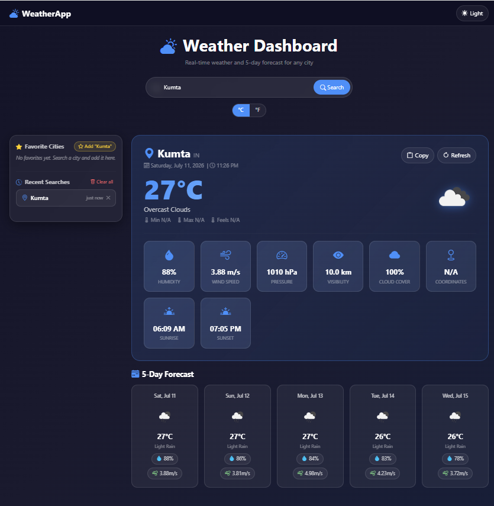
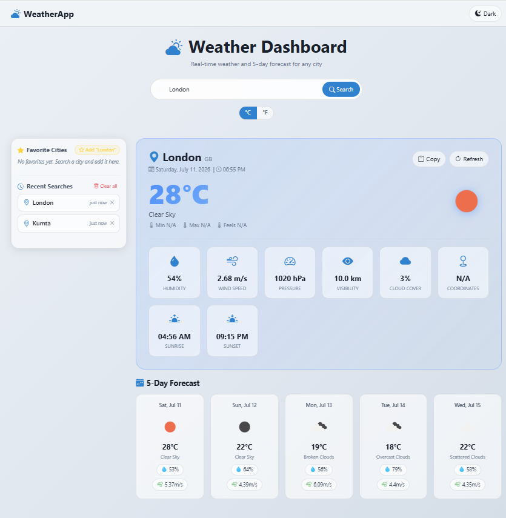

<div align="center">


# 🌤️ Weather App

**Full Stack Weather Application — Spring Boot + React**

[](https://openjdk.org/)
[](https://spring.io/projects/spring-boot)
[](https://reactjs.org/)
[](https://vitejs.dev/)
[](https://getbootstrap.com/)
[](https://maven.apache.org/)
[](LICENSE)

*Real-time weather data and 5-day forecasts — powered by OpenWeatherMap API*

</div>

---

## ✨ Features

| Feature | Description |
|---|---|
| 🌡️ **Current Weather** | Temperature · Feels Like · Min/Max · Humidity · Pressure · Wind |
| 📅 **5-Day Forecast** | Daily cards with weather icon, temp, humidity and wind |
| 🌅 **Extra Details** | Sunrise · Sunset · Visibility · Cloud Cover · Coordinates |
| ⭐ **Favourite Cities** | Add, remove and quick-search cities — saved in LocalStorage |
| 🕐 **Search History** | Last 10 searches with timestamps — delete single or clear all |
| 🌗 **Dark / Light Theme** | One-click toggle — preference saved in LocalStorage |
| 🌡️ **°C / °F Toggle** | Switch temperature units instantly |
| 🔄 **Refresh** | Re-fetch live data without retyping the city |
| 📋 **Copy Summary** | Copy full weather details to clipboard in one click |
| 📱 **Fully Responsive** | Works on mobile, tablet and desktop |

---

## 📸 Screenshots

<div align="center">
  
  &nbsp;
  
</div>

---

## 🏗️ Architecture

```
Weather-App/
│
├── weather-backend/                    ← Spring Boot REST API  (port 8080)
│   └── src/main/java/com/weather/
│       ├── controller/                 WeatherController.java
│       ├── service/                    WeatherService.java
│       ├── dto/                        CurrentWeatherDTO · ForecastDTO · ErrorResponseDTO
│       ├── config/                     WeatherApiConfig · CorsConfig · RestTemplateConfig
│       ├── exception/                  GlobalExceptionHandler · Custom Exceptions
│       ├── model/                      WeatherApiResponse
│       ├── util/                       WeatherUtil
│       └── WeatherApplication.java
│
├── weather-frontend/                   ← React + Vite SPA       (port 5173)
│   └── src/
│       ├── components/                 Navbar · Footer · SearchBar · WeatherCard
│       │                               ForecastCard · SearchHistory · FavoriteCities
│       │                               LoadingSpinner · ErrorAlert · ThemeToggle
│       ├── pages/                      Home.jsx
│       ├── services/                   weatherService.js  (Axios)
│       ├── hooks/                      useWeather · useTheme · useLocalStorage
│       ├── utils/                      weatherUtils.js
│       └── css/                        global.css
│
├── README.md
└── .gitignore
```


---

## 🚀 Getting Started

> **Prerequisites:** Java 21+ &nbsp;|&nbsp; Node.js 18+

### ① Start the Backend

```bash
cd weather-backend
./mvnw spring-boot:run
```

API available at → `http://localhost:8080`

### ② Start the Frontend

```bash
cd weather-frontend
npm install
npm run dev
```

App available at → `http://localhost:5173`

---

## 🔌 REST API Endpoints

| Method | Endpoint | Description |
|:---:|---|---|
| `GET` | `/api/weather/current?city=London` | Current weather for a city |
| `GET` | `/api/weather/forecast?city=London` | 5-day / 3-hour forecast |
| `GET` | `/api/weather/health` | Service health check |

<details>
<summary>📄 Error Response Format</summary>

```json
{
  "timestamp": "2025-07-11T10:30:00",
  "status": 404,
  "error": "City Not Found",
  "message": "City 'Xyz' not found. Please check the spelling and try again.",
  "path": "/api/weather/current"
}
```

</details>

---

## ⚙️ Configuration

`weather-backend/src/main/resources/application.properties`

```properties
api.key=your_openweathermap_api_key
api.base-url=https://api.openweathermap.org/data/2.5
server.port=8080
```

> Get a free API key → [openweathermap.org/api](https://openweathermap.org/api)

---


